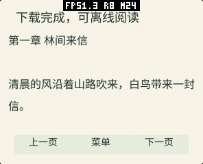
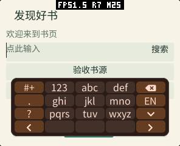
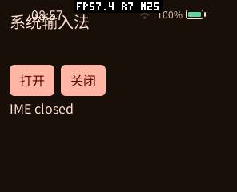
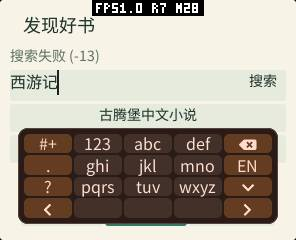
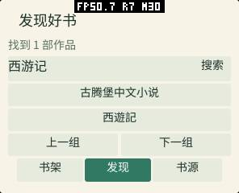
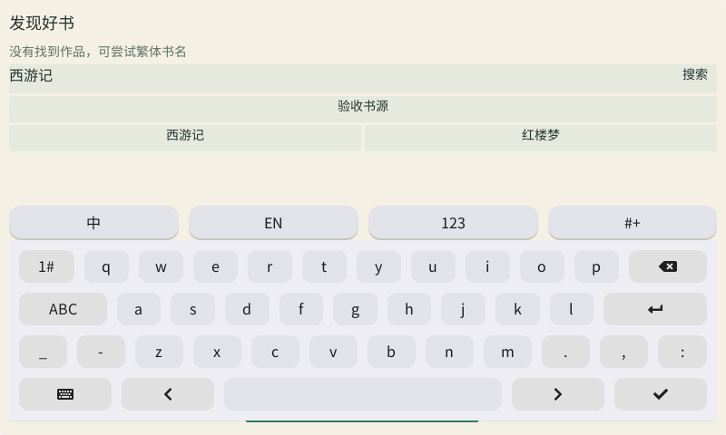

# 书页阅读 / C++ 系统输入法验收（2026-10-10）

工作区 `pxa-projects`，基础版本 root `c5bdd6a` / SDK `d600bc2` / apps `1a9b506`。本报告区分完成的测量、代码容量和未完成的测量。开发日志与 Flash 备份位于工作区忽略目录 `local/reader-20261010/`，不随应用打包。

## 已验证

| 项目 | 方法与结果 |
| --- | --- |
| 原生解析、状态、分页 | O3 + ASan/UBSan；JSON、UTF-8/代理对、范围校验、状态回读、10,000 次确定性模糊输入、不同 DPI 与三种屏幕形状通过 |
| 完整系统阅读器 | PXADB 点击实际控件并截图；搜索、TXT 与分章下载、目录、字号/行距、主题、自动翻页、书源导入及错误源 |
| 真实公网（完整系统模拟器） | 正式应用搜索“西游记”得到 1 项；下载 Project Gutenberg `23962` 的 UTF-8 TXT 共 **2,264,069 B**，本地索引 **100 回** |
| 真机公网搜索 | 最终正式包重试“西游记”得到 **1 项**，截图与 Guest `READER-SEARCH results=1` 日志对应 |
| TXT 传输正确性 | CC0 固定正文 **258,777 B**；完整下载 SHA-256 `f1401c49bf6a399717c05f9dbcd86ec63019f66e3e030f2a9a505078a574d7d9` 与服务器一致 |
| 分章传输 | 三章，共 **5,634 B**；校验章节合并与目录跳转 |
| 下载失败 | 第二段 HTTP 503、ETag 改变、空目录、非法 UTF-8 均拒绝发布完整缓存 |
| 离线与显示 | 从已有 QA 缓存重启，四组完整系统截图：296×240/160 DPI 圆角、360×480/320 DPI 圆角、480×480/320 DPI 圆屏、800×480/160 DPI 矩形；未产生下载请求 |
| 显式输入法接口 | C++ 示例按钮成功打开/关闭系统输入法；原生测试覆盖 Ref 生命周期、重复挂载、所属节点验证、隐藏/禁用输入框、空文本、UTF-8 截断和提交 |
| 输入法主题 | 实际 LVGL 测试 20 次换色、模式切换、打开/关闭与目标删除，内容保留；浅色、深色截图覆盖窄屏 K9 与宽屏 K26 |
| 输入法安全区 | 6 组尺寸 × 3 种形状，逐像素验证键盘矩形在显示形状内 |
| 回归 | C++ SDK 全套、Core/UI、POSIX FS、LVGL、WAMR、HTTP 响应头、ESP Host 与包工具测试通过 |

真实 Gutenberg 下载 SHA-256 为 `af3c9e408c0c58595b666ed9981b6fa1e9343f4bbc78309b1cb0818c32fc1f58`。文件版本由网站决定，复测时可能变化。它与固定 CC0 工作负载分别记录，不用于语言性能对比。

## 实现变化与资源

| 原因 | 收益 | 内存影响 | 验证 |
| --- | --- | --- | --- |
| 应用重复做输入法不合适 | 新增可选 `TextInputRef.show_keyboard/hide_keyboard`，复用系统词典与主题 | 调用只有 12 B 栈载荷，不分配堆；原有 `TextInput(value)` 仍为单指针大小 | SDK、LVGL、Core、WAMR 与完整系统示例 |
| 候选/符号页及按下颜色不完整 | 键盘全部语义角色跟随系统主题，保留组合输入 | 已打开对象就地改色，没有新增键盘副本 | 20 次换色/模式循环 |
| 模拟器 Guest 丢失 DPI；宽键盘沿用底部锚点 | 高 DPI 字号和命中区域正确；宽屏键盘返回可见区 | DPI 字段传递和几何计算，无新增缓存 | 四组真实像素截图 |
| 首版私有键盘与过大协程池 | 移除私有拼音数据；协程池由 16×2 KiB 改为 8×2 KiB | Wasm 最小线性内存 **192 KiB → 128 KiB**；池预留 **32,784 B → 16,400 B**；默认 SDK 池不变 | 编译器 memory section、QA 池统计 |
| 读取全文占用过大 | 32 KiB 分段 + 4 KiB 搬运，16 KiB 分页缓冲，本地索引 | 不把整本小说放入 Guest 内存；容器均有上限 | 2.26 MB 真下载和跨分段 UTF-8 测试 |
| 固定 Canvas 字号不能做阅读排版 | 可选 `TEXT_SIZED`，复用 Host 中国大陆字体 | 按使用创建，单适配器最多 16 个字号；精简重复配置，未创建 Canvas 字体的应用不分配字库 | 解析/适配器/高 DPI 截图；字体实际堆占用见下方测量边界 |
| 现有 rename 不覆盖文件，反复保存失败 | 新增 FS 0.2 `replace`，原子发布已关闭普通文件 | 不复制正文到 RAM；源/目标使用现有路径缓冲 | POSIX 文件内容、配额、打开文件拒绝及 SDK wire 测试 |
| HTTP 大小写响应头造成协议错误 | desktop provider 规范化为小写，修复 Content-Type 长度判断 | 使用现有头部存储 | Range / ETag / MIME 混合大小写 ASan 测试 |
| 自定义源跨域受原权限模型限制 | Net 0.3 显式声明/授权 `web` scope；旧精确 origin 权限仍先检查 | 不默认授予或预分配网络能力 | Core legacy/v1 权限回归，应用真实搜索 |
| 小屏/弧边裁切控件 | 安全宽度按每行计算，导航上移直到文字可容纳 | 固定容量几何运算，无每帧布局缓存 | 圆屏截图与原生形状测试 |
| 浅色纸张上的输入框继承深色系统白字，高 DPI 字号偏小 | 文字按阅读配色设置；按 DPI/行高选择已有 Host 字体档位 | 固定输入框模型颜色和字号字段，无新增控件或字体缓存 | 四组屏幕输入文字、系统键盘截图 |

阅读器绘制命令固定容量 4,000 B、命中区 64 项、上一页位置 64 项、页行 64 项；搜索 32 项、书架 16 项、来源 8 项、目录 1,024 项。目录/资源操作有动态字符串与有界 vector，交互和排版不会创建无限缓存。空闲不重绘，每 250 ms 唤醒一次；指针释放直接处理界面，不必等待下次周期。

最终正式 ESP32-S3 单架构 AOT 包：打包 **589,690 B**、未压缩 **774,008 B**（AOT 773,992 B，资源索引 16 B）。同时包含 x86_64 和 ESP32-S3 的包为 **888,809 B** / **1,239,208 B**，其中 x86_64 AOT 为 **465,200 B**。这些容量只描述对应构建，不作为性能指标。两者 O3，未使用体积优先优化。2 MiB 是 Guest 上限，128 KiB 是编译时最小值，不能把它当作运行峰值。

## 真机及测量边界

pai-touch 的实际串口为 `/dev/ttyACM0`，ESP32-S3 MAC `a4:cb:8f:d5:d4:f0`。先备份 16 MiB Flash，再只更新 `0x10000` 应用分区；固件写入哈希校验通过。原应用、数据和分区表保留。正式阅读器已安装；为释放安装空间移除了本轮创建的 QA 包。系统设置没有更改。

更新后冷启动空闲快照：SRAM free **46,291 B**，PSRAM free **6,978,136 B**。PXA 共享预算 internal **27,468 B**、external **16,516 B**、fixed **2,224 B**；Surface frame/mailbox/raster 为 0。pai-touch 原为 1 MiB，esp-mosaico 原用默认 64 KiB；两者改为 8 MiB 的磁盘配额，只修改持久化上限，不分配 RAM。

早期 192 KiB Guest 的样本阅读快照为 SRAM free 44,855 B、PSRAM free 6,096,716 B；键盘打开时 PSRAM free 5,838,824 B。**这些是早期实现，不能冒充最终版数值。** `heap_min` 为从启动以来的历史最低值，包含启动、安装和过去运行，不能据此推算本应用峰值。FreeType 字形缓存不完全计入 PXA 共享预算，必须同时看 ESP heap。

最终真机采用隔离身份 `pxa-novel-reader-qa`，所有书架、下载与设置均由实际应用界面创建，PXADB 只读取私有文件，没有绕过私有目录的写入限制。字号从 16 增至 28、减至 12、恢复 16；打开/收起系统 K9 键盘。完整正文成功原子发布为 `.txt`，SHA-256 与上表固定 CC0 正文一致。发现并修复了**分页读取仍持有 `.part` 时发布返回 busy** 的真机问题：发布期间暂停新分页读取，等待已有读取关闭，有界等待和取消都会清理发布状态。刷新和删除前也取消旧读取任务。

快速启动/停止 3 次后，包含完整缓存的书架 JSON 保持一致。随后停止 LAN 测试服务器，重新启动 3 次；逐次检查实际阅读画面并翻页，持久化位置 **0 → 82 → 198 → 314 B**，证明是在读取缓存正文。启动时尚未完成书架加载的窗口禁止保存，避免快速退出覆盖原书架。

C++ SDK 独立示例的“打开”“关闭”按钮在真机分别调用 `show_keyboard` 和 `hide_keyboard`，键盘区域截图差异校验通过。模拟器同时验证浅/深主题、宽/窄键盘及 4 组分辨率/DPI/形状。输入框字号修改后的完整系统最终回归 **88 步**（前次复跑为 84 步，设置初值改变自动翻页间隔所需步骤），协程池峰值 **7/8**，耗尽次数 **0**。重复导入验收源达到 8 项后应用正确拒绝新增；最后回归使用独立 QA 的空白状态。CLI 点击到 UI 日志的前次中位数 230.55 ms、P95 329.2 ms，包含命令与日志等待，**不能当作触摸到 LCD 的延迟**。

以下为发布等待修复后隔离 QA 的同一次运行，在最后输入框配色/字体档位修改前采集；不是最终正式包所有场景的峰值。设备已运行过其他应用，音频/网络等系统模块已有初始化。记录的是**整个设备**的可用堆内存；`MEMORY START/STOP` 使用 ESP-IDF 分配器本次窗口最低值，能覆盖两次快照间已经释放的瞬时分配，截图放在测量窗口外。不能把这些数值与上面的冷启动早期版本直接作性能/内存对比。

| 阶段 | SRAM 稳定 free / 窗口 min（B） | PSRAM 稳定 free / 窗口 min（B） |
| --- | ---: | ---: |
| 启动前空闲 | 25,807 / 历史 9,892 | 6,684,832 / 历史 4,580,600 |
| 初始化并阅读示例 | 24,647 / **16,667** | 5,876,992 / **4,960,960** |
| 字号切换后 | 24,647 / 本窗口 16,495 | 5,810,400 / 此时 5,675,228 |
| 同一窗口再打开输入法 | 24,647 / **16,495** | 5,559,036 / **5,263,512** |
| 网络下载并发布 | 24,647 / **16,427** | 5,810,392 / **5,756,816** |
| 后续三次缓存阅读 | 各次 24,611 | 5,809,972 / 5,809,396 / 5,809,496 |
| 最后停止应用 | 25,699 | 6,640,356 |

首次启动相对该窗口空闲的 PSRAM 稳定增加约 808 KB、瞬时最高增加约 1.72 MB；字号与输入法窗口额外瞬时占用约 613 KB。下载窗口额外瞬时占用 **53,584 B**（5,810,400 − 5,756,816），SRAM 为 **8,220 B**（24,647 − 16,427）。初始化峰值包含 AOT 加载/映射及系统 UI 构建，稳定值包含字体和 UI；这些是测量结果，不能声称所有功能“零内存”。停掉阅读器后的差额约 44 KB 包含系统字体/界面缓存和当时状态，三次阅读稳定值没有递增趋势，但不是长期泄漏证明。

Guest 编译最小线性内存 128 KiB、上限 2 MiB；实际启动日志为 131,072 B，历史曾观测到 196,608 B，因此上限、最小值和运行值分别记录，不把某个历史峰值标成最终全场景上限。QA AOT 映射按 64 KiB 页对齐为 786,432 B。原生显示缓冲由系统已有显示流水线占用；应用没有另建阅读帧缓冲或深度缓冲。各快照 PXA Surface frame/mailbox/scratch 为 0，shared budget internal 27,468 B、external 16,633 B，拒绝/分配失败均 0；Surface peak 573,696 B 和 shared budget peak 来自本次开机之前的其他应用测试，**没有重置，不能归给阅读器**。Native Canvas 命令和 FreeType 的分项峰值没有独立计数，已包含在 ESP 堆窗口。

原始数字、验证项和离线快照保存在 [device-results.json](device-results.json)，UI 动作在 [ui-actions.json](ui-actions.json)。最终正式包再次核对示例阅读、搜索框深色文字、系统键盘开关及原有四个应用目录。测试 QA 和 SDK 示例包已移除。设备覆盖安装时暂存空间不足，本轮只重装了新建阅读器；卸载会清理该包私有目录，其原先只有默认示例书架和设置，已通过应用操作恢复，并与测试前 JSON 逐字段核对一致。没有修改系统设置，FPS 调试覆盖层是设备原有设置。

最终真机公网搜索首次返回 `PXA_STATUS_UNAVAILABLE (-13)`，稍后使用相同正式包和书源重试成功，画面显示“找到 1 部作品 / 西遊記”，Guest 日志 `READER-SEARCH results=1` 对应。第一次失败的具体网络原因未定位；重试通过不能保证来源长期可用。真机 LAN 完整下载与停止服务器后的离线读取已经通过；上述 Gutenberg 2.26 MB 完整下载来自完整系统模拟器。最终正式包停止后的单次快照 SRAM free 45,471 B、PSRAM free 6,871,168 B，文件系统剩余 **1,093,632 B**，与前面的 QA 窗口起点不同，不作为前后内存改善证据。存储容量不足以在保留当前应用的同时再下载 2.26 MB 的 Gutenberg 正文。











## 复现

以下命令从工作区根目录执行。隔离 QA 身份不会覆盖正式阅读进度。

```sh
SANITIZE=1 bash local/pxa-apps/novel-reader/tests/test.sh
python3 local/pxa-apps/novel-reader/tests/fixture_server.py
python3 local/pxa-apps/novel-reader/tests/build_playtest.py \
  --target simulator --output local/reader-qa \
  --source http://127.0.0.1:18764/catalog.json
python3 tools/pxadb/pxadb.py package install \
  local/reader-qa/artifacts/pxa-novel-reader.pxa --simulator pai-touch@reader-qa
bash tools/simulator.sh ui run --profile pai-touch --instance reader-qa \
  --launch pxa-novel-reader-qa > local/reader-qa/system.log 2>&1
# 在另一个终端：
python3 local/pxa-apps/novel-reader/tests/playtest.py \
  --simulator pai-touch@reader-qa --log local/reader-qa/system.log \
  --output local/reader-qa/screens
python3 local/pxa-apps/novel-reader/tests/display_probe.py \
  --state local/simulator/pai-touch@reader-qa --output local/reader-qa/displays
```

先 `tools/simulator.sh service start --profile pai-touch --instance reader-qa` 启动安装服务。不要用 `package run --simulator` 替代完整 UI 启动，它会启动无系统输入法的独立 product。
每轮完整交互测试使用新的 QA 实例名，避免重复导入验收源达到来源容量上限。更新已安装应用使用 `package install --yes` 覆盖安装；不要为更新先卸载有用户数据的应用。

真机：把 fixture server 绑定到 `0.0.0.0`，QA 书源替换为设备可访问的电脑 LAN 地址，使用 `--target esp32s3` 构建并安装。实际端口为 `/dev/ttyACM0`。

```sh
python3 local/pxa-apps/novel-reader/tests/device_probe.py --reset \
  --port /dev/ttyACM0 --output local/reader-qa/device
# 停止 LAN fixture server 后，使用已有的完成缓存再次验证真正离线：
python3 local/pxa-apps/novel-reader/tests/device_probe.py --cached-only \
  --port /dev/ttyACM0 --output local/reader-qa/offline
```

`--reset` 只清理硬编码的独立 QA 身份，不触碰正式数据。脚本使用一条连接、检查前台身份、分开唤醒/解锁，并等待真实界面；在慢速重绘下使用 300 ms 按压，不能把这个自动化时长当作最低响应时间。键盘开关需人工或截图检查；离线脚本还校验正文像素与翻页后的持久化位置。截图传输错误/限速有界重试。其他线程切换应用时该组测试应作废，不能把锁屏或书架截图当成阅读成功。正式应用可通过“发现→西游记”复测实际网络。

## 尚未支持或尚未量化

64 字节输入事件上限、长英文保守排版、跨重启准确回退上一页的有限回溯、非标准章节标题、断点续传、EPUB/HTML/Legado 规则兼容均仍有限制。后续若增加长输入、网页解析等能力，应采用可选接口及有界缓冲。

本轮不以提交 FPS 宣称阅读收益，也没有给字体缓存或网络启动峰值作没有测量依据的“不增长”承诺。热路径、缓存上限和最小内存下降是已验证结论；已记录的真机峰值对应独立 QA 运行的 allocator 窗口，正式包、长期运行和全部网络源的极端负载仍应分别测量。
