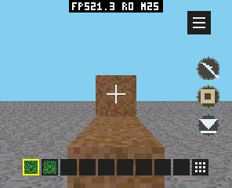
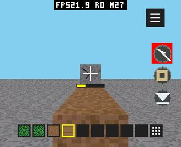
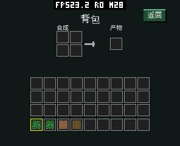
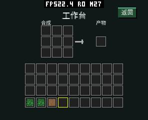
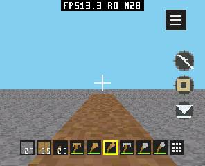

# Voxel Craft C++ 0.12：有限背包、合成、材质音效与工具

本轮把创造式物品选择改为有限背包，加入逐方块挖掘进度、真实合成、木/石工具和
耐久，修复地面植被选中、远处裂纹及全屏残留状态栏。继续使用 O3、完整透视
纹理和 Z-buffer。压缩的是 Guest 区块缓存记录，容量和画质不变；同一树林/HUD
的显示帧率基本持平，不能把功能完成或 Guest 几何变快说成 LCD FPS 提升。

代码分为 `27070bd`（区块缓存）、`e827ba0`（植被选择）、`b6bd6c7`（玩法、工具及
声音）、`43df055`（隔离自动验收）。Host 缓存修复已包含在 `20f3ae0`；SDK 全屏
独立系统栏模式在 `bf25c19`。共享工作区另一个任务的音频、显示及板型提交保留。
完整源版本、包/AOT 哈希、编译器和固件哈希见 [provenance.json](voxel-gameplay-20261009/provenance.json)。

## 本轮改动与代价

| 改动 | 原因及收益 | 内存变化 | 验证 |
| --- | --- | --- | --- |
| MeshQuad 8 B → 4 B | 字段均为区块局部坐标，按实际范围打包；减少 PSRAM/Guest 占用 | World 393984 → 246528 B，仍为每块 192 quad、八格区块 | 32 种子、3062 棵树，最大 173 quad；编辑超容量分页和零帧内分配通过 |
| 植被射线与碰撞分开 | 地面树叶/草丛不会被射线跳过，选中和碰撞采用各自规则 | 不增加缓存 | 真机依次采集草丛、树叶及其后的实体；原生 raycast 回归 |
| 逐目标挖掘与深度裂纹 | 各材质耗时不同；换目标/工具、取消、菜单、后台清零；远处裂纹避开自身深度量化冲突 | 少量固定进度字段，裂纹最多有界小 quad；同一 DrawList/深度 | 真机进度截图；近处遮挡和 cutout 的原生真实光栅化哨兵 |
| 有限背包及真实配方 | 空背包新游戏，采集增加、放置消耗；满包不删除方块；2×2/3×3 配方实际扣材料 | 36 格共 108 B，配方引用 9 B；事务临时副本仅 108 B 栈 | 原生满容量回滚、镜像/平移配方、真机触屏及三槽存档 |
| 六种工具及耐久 | 镐/斧/铲匹配材料；木 2×、石 4×，错工具为徒手；成功采集扣一次耐久 | 3 B/格含耐久，无工具对象池或堆分配 | 全六配方、错误工具、耗时、取消、耗尽及重启恢复 |
| 八类材质 PCM | 替换统一提示音；起音、衰减、接触噪声和两组共振，轻微音高变化 | 每动作一个最大 320 采样包，640 B 栈；无驻留样本库；使用原 Host 音频队列 | 波形、首尾零采样、无削波；真机 Host 提交/完成无队列满 |
| v3 存档 | 保存全部类型、数量及耐久，兼容 v1/v2；读回校验再发布有效索引 | 80 B 头 + 98304 B 世界 + 108 B 背包；每文件 98492 B，三槽双版本磁盘 590952 B | 损坏库存尾字节拒绝、原世界保留、修复后重试；复用暂停网格暂存，无 96 KiB 副本 |
| 提前决定可选音频权限 | 首次权限弹窗与游戏大缓冲同时存活会抬高 PSRAM 峰值 | 64 B 借用请求，授权前无游戏 Surface/Z/mailbox；未增加任务池 | 新身份三次等待弹窗后停止、首次允许及拒绝路径 |
| 每次前台隐藏状态栏及 Host 快照失效 | 首帧前参考叠加对象已改变，旧 launcher 快照却被“已构建”短路保留 | 仅复用失效标志，未加图层/缓冲/任务 | 真实 LVGL/ASan 回归，未修复源码确定失败；新固件真机无时钟/电量残影 |

`VoxelCraft` 原生对象 446608 → **299048 B**，包括 World、有限物品及所有界面字段。
命中表通过紧凑十字节记录变为 470 B，原为 768 B。三档灰度字体原始尺寸仍为
12100/23716/39204 B，Sarasa Gothic SC 大陆黑体；本轮字集 118 个，未增加图集。
工具图标由最多八个纯色小 quad 组成，不新增纹理；标题、背包、HUD 都直接画入
原游戏 Surface，Canvas 只接收输入。

## 固定场景的实际显示性能

基线是 `a23563d` 的 **0.10 优化后 HUD**，用当前 SDK 重建；最终为本轮 0.12。
两者均在同一 Host 固件 `558ea7f…` 测量：296×240，固定种子 `0x5ae1`，公共
S2 地图，相机眼睛 `(18.5,9.6,18.5)`、yaw `0.7`、pitch `-0.15`、FOV
`1.221451928`、近面 `0.25`、视空间远面 `24`。完整透视纹理、中性光照，关闭
物理/自适应视距/音频/挖掘，HUD 保留同样八堆 64 件物品。正式空背包、九槽工具
和随机新游戏不能直接代替这一等工作量的对照。

每包三次独立运行，先预热 24 秒并确认至少 120 帧，再记录 8 秒 LCD 完成间隔。
性能包不启用 `VOXEL_PROFILE`。截屏在采样窗口及 MEMORY STOP 之后；PERF
记录器单列 2112 B，不把其内存扣成“估算后的真实峰值”。

| O3 等工作量 / 同一最终 Host | LCD FPS（三次） | 平均 FPS | Host 光栅化均值 |
| --- | --- | ---: | ---: |
| 0.10 优化后 HUD | 11.366 / 11.362 / 11.265 | 11.331 | 39.944 ms |
| 最终 0.12 同 HUD fixture | 11.331 / 11.301 / 11.237 | 11.290 | 39.483 ms |

每次命令列表都是 **18576 B**，光栅化工作量都是 **134250 像素**；无 probe
溢出、Surface 变化或丢帧。三轮平均显示变化 **-0.36%**，不构成帧率
提升证据。Host 光栅化均值 39.944 → 39.483 ms，但显示受
Guest、Host 抢占、传输完成和显示节拍共同限制。固定场景图片核对见
[before](voxel-gameplay-20261009/bench-before-0.jpg)、
[after](voxel-gameplay-20261009/bench-after-0.jpg) 和 [画面比较](voxel-gameplay-20261009/picture-comparison.json)。
顶部时钟/FPS 文本不参与世界像素一致性判定；叶孔、材质坐标和世界几何未降级。

最终同一固件另建 `VOXEL_PROFILE=1` 包，分别测量更新、几何、编码、HUD、提交
和 Host 排队/显示；该包增加时钟调用和统计查询，有观察者成本，其 FPS 不用于
上述结论。固定地图的 Guest update 为零是主动关闭模拟的结果，不能据此宣称
正常游戏更新零成本。提交墙钟包含 Host 抢占和背压，不等于 Guest CPU 时间。

| 诊断均值（ms） | 0.10 | 0.12 |
| --- | ---: | ---: |
| Guest 更新 | 0.000 | 0.000 |
| 几何准备 | 25.076 | 25.930 |
| 命令编码 | 5.766 | 5.944 |
| HUD 编码 | 1.235 | 1.272 |
| 提交墙钟 | 45.075 | 44.686 |
| 整帧构建与提交 | 77.253 | 77.925 |

取两包最后的累计均值，分别为预热 120 帧后的 215/202 个构建样本。当前诊断包的几何和编码略增，不能用前期 0.11 的不同记录宣称最终几何加速。

诊断串口第 24–33 秒的累计计数差分：Host 排队均值 2.703 → 2.782 ms，提交显示后的完成耗时 36.175 → 36.634 ms，双方废弃帧为零。这些阶段可重叠，不能相加推算 LCD FPS。

本轮未在无实测收益时加入 SIMD、额外 SRAM 行缓存、并行渲染任务、更大帧队列
或默认大型缓存；尝试过将压缩 quad 再逐个复制到局部的路径，没有收益，已撤回。
完整纯色/仿射/透视 Z 内核、材质分类、裁剪及 SDK 相机/批处理/输入/对象池/计时
能力详见 [前轮 3D 报告](pxa-3d-20261009.zh-CN.md)。micropixel 原目录本地改动保留，
此前独立检出 `4e821388` 的扫描线、材质和背压设计仍为参考；未采用其无 Z 排序。
前轮严格无 HUD 的 C/C++ 数据保持在前轮报告，本轮含 HUD 的数字不与之混作
语言性能比较，也不把更换了固件的测量当作旧固件速度复现。

## 正式包内存与真实峰值

同一最终 Host，先安装无测试宏的原 0.10 正式包，再安装全字体 0.12 正式包。
每包先硬件重启，再从标题新游戏/停止三次；没有保存、截屏或 PERF 分配，保持
原应用数据。每次实际 launch 前 MEMORY START，停止应用前 MEMORY STOP。
分别报告 SRAM/PSRAM 本次最小剩余量，首次冷启动和随后热启动分开；历史
heap minimum、budget peak、surface peak_total 不代替本次峰值。

生产新游戏按正常种子生成；本节比较相同启动动作及固定容量内存，不把不同
随机地图的 FPS 或光栅化耗时拿来比较。固定场景的性能对照在上一节单独进行。

| 无 PERF/JPEG，标题→新游戏/停止（B） | SRAM 游戏稳定 | SRAM 本次峰值 | PSRAM 游戏稳定 | PSRAM 本次峰值 |
| --- | ---: | ---: | ---: | ---: |
| 0.10 冷启动 | 272896 | 277032 | 3116204 | 3910148 |
| 0.10 热启动 1 | 272932 | 277032 | 3116172 | 3909796 |
| 0.10 热启动 2 | 272932 | 277032 | 3116220 | 3909928 |
| 0.12 冷启动 | 286260 | 297368 | 2982132 | 2995424 |
| 0.12 热启动 1 | 286260 | 294240 | 2982092 | 3198292 |
| 0.12 热启动 2 | 286260 | 294292 | 2982584 | 3198792 |


新包稳定总占用比匹配旧包低约 **117.5–117.9 KiB（字节差为 120308–120752 B）**，PSRAM 本次峰值均降低。SRAM 稳定占用增加 **13328–13364 B**，本次峰值增加 **17208–20336 B**，本轮没有达到 SRAM 单独不增长。声音播放启动了共享 Host 混音器，日志显示其 storage=8640 B、stack=4096 B；未将其余差额逐分配隔离。降低的是整体占用，不能隐藏区域代价。峰值变化还包含全屏状态栏和初始化流程调整，不能全部归因于 quad 压缩。

| 单独核对（B） | 0.10 正式 | 0.12 正式 | 说明 |
| --- | ---: | ---: | --- |
| Guest 已提交线性内存 | 589824 | 393216 | 9 → 6 页，最大声明 32 页；64 KiB 辅助栈保持 |
| S3 AOT 文件 | 585948 | 696508 | 新功能及 O3，不以缩体积降低优化等级 |
| S3 text 映射请求 | 547848 | 653708 | 使用实际 Host `AOT mapped` 日志，排除文件头等数据 |
| S3 可执行映射 | 589824 | 655360 | 请求按 64 KiB 粒度；包含在实际 PSRAM，不与它再次相加 |
| RGB565 帧缓冲 | 284160 | 284160 | 两张 296×240 |
| Z16 深度缓冲 | 142080 | 142080 | 一张，叶孔仍不写 Z |
| Host 命令队列 | 147456 | 147456 | 原三份 49152 B |
| 常驻 PCM 样本银行 | 0 | 0 | 游戏每次按需生成；Host 共享混音器资源另计入 SRAM/PSRAM |

功能增加了音频 voice/共享混音器开销，代码映射也变大；不能声称每一种区域均
逐字节下降。性能优化本身没有扩大帧、深度、命令队列或缓存；最终稳定和本次
峰值实测在上表核对。SRAM/PSRAM 区域最高值不一定同时发生，不能把两个
最高值之和称为某时刻的实际总峰值。辅助栈实际使用高水位尚未加扫描器测量。

隔离交互地图另测不截图的完整采集、合成、工具及保存流程：基础玩法本次
SRAM/PSRAM 峰值 **290608/3265596 B**，六工具流程 **290568/3248556 B**。
首次授权 **290480/3269288 B**；三次停止待授权应用均无 frame/scratch/mailbox。
这些是各自运行的区域峰值，不能拿不同地图或首次授权范围直接作生产版本比较。
同一报告中的 `memory` 字段可能含截屏或既往最低值；干净交互窗口必须读取
`launch_gameplay_peak`，不能误用历史字段。

## 玩法、画面及声音验收

真机和独立模拟器逐格完成六个 3×3 工具配方，挖掘日志记录纯挖掘阶段，另加
0.30 秒长按启动时间。误差是固定 16 ms 模拟步量化，未用 FPS 估计挖掘时间。

| 方块 / 工具 | 目标秒数 | 真机秒数 | 结果 |
| --- | ---: | ---: | --- |
| 工作台 / 木斧 | 0.800 | 0.803 | 2× |
| 石头 / 木镐 | 1.600 | 1.604 | 2× |
| 石头 / 石镐 | 0.800 | 0.803 | 4× |
| 原木 / 石斧 | 0.400 | 0.404 | 4× |
| 泥土 / 石铲 | 0.1625 | 0.164 | 4× |
| 泥土 / 木铲 | 0.325 | 0.340 | 2× |

工具流程保存后重启，库存哈希、六种工具数量及剩余 59/131 次耐久全部一致。
取消、目标切换、前后台和菜单暂停复位，满包保留方块/工具，重复保存及三个
槽位均检查。v1/v2/v3 原生迁移及模拟器损坏尾字节拒绝通过。







顶部 `FPS… F… H…` 是用户已有开启的开发 FPS 浮层，独立于系统时钟/电量状态栏，
未修改这个设置。曾出现的时钟残影来自 Host 桌面快照没有在参考对象变化时失效，
不是游戏另加了 HUD 层。真实 LVGL 回归使用 64 B 缓冲对齐，旧源码确定在隐藏
首帧前状态栏的断言失败；修复后保持不变的 shell 30 次刷新没有重建或新增分配。

音效分树叶/植物、泥土、砂砾、雪、木、石、玻璃、羊毛，按材质生成不同波形。
打击 12 ms、破坏 20 ms、放置/合成 16 ms，均为 16 kHz 单声道一个包。
原先多包设计在模拟器触发 WouldBlock，改为单包后真机六工具运行 Host
**submitted=38、rendered=38、peak_queue=1、queue_full=0、stale=0、rejected=0**。
串口回放会重复单条应用日志，不能把日志行数当成物理播放次数。
八类的波形不同、首尾零采样、边界和削波检查均通过；真机流程覆盖植物、土、
木、石材质，其他四类的音色以原生波形检查为证据，没有声学录音或主观盲听。
[音效审听 WAV](voxel-gameplay-20261009/material-sounds.wav) 顺序为上述八类，每类
打击/破坏/放置；此文件不打包，也不是设备扬声器录音。听感优劣须实际听音判断。

多分辨率模拟器：240×296 / 240 DPI 选 10 px，412² / 320 DPI 选 14 px，
800×480 / 480 DPI 选 18 px；标题、设置、背包及返回游戏通过。布局与命中
共用安全边距、圆角及 DPI 计算。保留大陆黑体和灰度 alpha 抗锯齿，未为工具
名称增大图集或引入运行时字体引擎。

## 复现及收尾

从 pxa-projects 根目录执行。pai-touch 本次为 ttyACM0，使用
`/dev/serial/by-id/usb-Espressif_USB_JTAG_serial_debug_unit_A4:CB:8F:D5:D4:F0-if00`；
另一块连接的开发板没有参与。一次仅一个串口客户端。设置、音量、亮度、待机
超时及 FPS 开关保留；只刷 app 分区，不刷引导、分区表或数据分区。

```sh
SANITIZE=1 bash local/pxa-apps/voxel-craft-cpp/tests/test.sh
SANITIZE=1 bash tools/test-system-overlay-cache.sh
bash deps/pxa-system/tools/package/test_guest_cpp.sh
bash tools/app.sh build voxel-craft-cpp --target all
PXA_APP_DEFINES=VOXEL_BENCH_SCENE=2,VOXEL_BENCH_HUD=1 \
  bash tools/app.sh build voxel-craft-cpp --target esp32s3 --aot-only --output local/voxel-bench
python tools/measure-device-voxel.py --port /dev/ttyACM0 --app pxa-voxel-craft-cpp \
  --warmup 24 --minimum-warm-frames 120 --seconds 8 --repeat 3 --wake-home --local-heap \
  --package local/voxel-bench/pxa-voxel-craft-cpp.pxa --output local/voxel-bench-measure
```

基线用 `git archive a23563d` 到独立 source-root，并链接公共素材及开发签名目录；
相同 SDK、编译器、定义和固件下构建/安装后再测。诊断阶段另加 `VOXEL_PROFILE=1`，
生产内存包去掉全部测试宏。测量脚本只测已经安装的指定包，`--package` 记录哈希，
不会替你安装它。隔离玩法、音效、工具、首次权限和冷/热内存命令见
[tests/README.zh-CN.md](../../tests/README.zh-CN.md)。

ASan/UBSan 应用原生回归、SDK 全套、Host native/ESP adapter 回归、真实 LVGL
缓存回归及 O3 Wasm/S3/S31/x86 AOT 构建通过。实际 S31 设备、突然断电、长时
声学录音、铁/钻石工具、动物攻击、箱子/熔炉、装备栏、物品拆堆/丢弃仍未实现
或未验证，不能标作完整 Minecraft 功能或整个 SDK 发布验收完成。

收尾已恢复并核验全字体 **0.12.0 / release 13** 正式包，设备安装 AOT 和
manifest/三档字体的 SHA 与构建产物逐一相等。仅清理、卸载本次 UI2/UI3/UI4
隔离身份及本次 inbox 文件。四个原应用保留，全部 inactive、staged=0；原有
五个私有数据文件字节数和 SHA 与测试前完全一致。停止后 frame/scratch/mailbox/
probe 均为零，budget allocation_failures=0；独立模拟器服务也已停止。
[最终核验 JSON](voxel-gameplay-20261009/final-verification.json) 和正式包
[标题](voxel-gameplay-20261009/production-final-title.jpg)、
[游戏](voxel-gameplay-20261009/production-final-game.jpg) 截图保留。
新固件下又用 UI4 实测拒绝音频权限后 ready 和停止释放，
[拒绝报告](voxel-gameplay-20261009/permission-overlay-fixed-denied.json) 独立记录。
补测安装曾触及空间准入限制；删除本次正式包的 inbox 副本后成功，未删除原应用或数据。

原始构建、测量源码、测试包及串口记录保留 workspace
`local/voxel-gameplay-20261009/`。此目录的
[measurements.json](voxel-gameplay-20261009/measurements.json) 与原始场景报告包含
最终数字；`intermediate-0.11/` 仅保存前期排查证据，固件/源码较旧，不能与最终
0.12 数据混算平均值或峰值。
